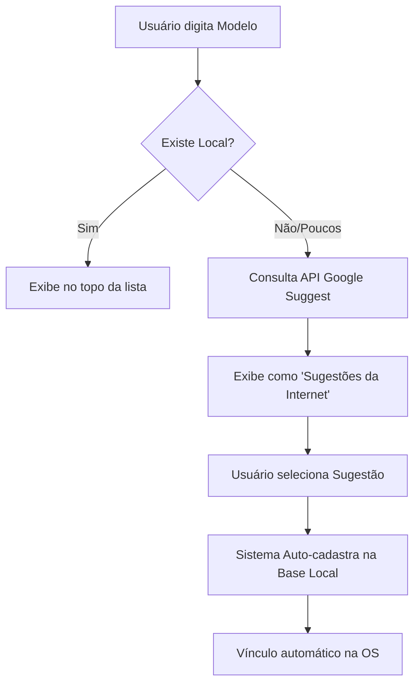

# Ponte de Modelos (Integração com APIs Externas)

Esta funcionalidade foi projetada para reduzir erros de digitação e padronizar o cadastro de novos modelos de equipamentos (Celulares, Notebooks, TVs, etc.) utilizando inteligência híbrida.

## Como Funciona

O sistema utiliza um fluxo de consulta em duas camadas simultâneas:

1.  **Camada Local**: Consulta a tabela `equipamentos_modelos` no banco de dados da assistência.
2.  **Camada Externa**: Caso o modelo não seja encontrado localmente, o sistema faz uma requisição para a API do **Google Autocomplete (Suggest)**.

### Fluxograma de Decisão



## Implementação Técnica

### Controller: `App\Controllers\ModeloBridge.php`

O controller gerencia a lógica de limpeza do texto e fusão dos resultados. 

*   **Identificador de Origem**: Resultados externos recebem o prefixo `EXT|` no ID. O Google Suggest não retorna um ID numérico da entidade, então um sub-hash do nome é gerado.
*   **Limpeza de Título**: Como as APIs indexam termos comuns de busca, o sistema aplica um filtro para extrair palavras como "smartphone", "celular", reduzindo o termo apenas ao que interessa (ex: "samsung a54" -> "Samsung A54").

### Endpoint de Busca

`GET /api/modelos/buscar?q={termo}&marca={nome_marca}&marca_id={id_local}`

### Exemplo de Resposta (JSON)

```json
{
  "results": [
    {
      "text": "Modelos Cadastrados",
      "children": [
        { "id": "45", "text": "Galaxy S21 Ultra", "source": "local" }
      ]
    },
    {
      "text": "Sugestões da Internet (Auto-cadastro)",
      "children": [
        { "id": "EXT|GGL_ab4d7f", "text": "Samsung Galaxy A54 5g", "source": "google" }
      ]
    }
  ]
}
```

## Benefícios para a Assistência

1.  **Padronização**: Evita variações como "S21", "Samsung S-21", "S21 5G" no banco de dados.
2.  **Agilidade**: O técnico preenche o modelo com 2 ou 3 cliques aproveitando o completamento inteligente da maior base de dados de busca do mundo.
3.  **Resiliência**: O uso da API de sugestões do Google evita falhas por bloqueio de API (como no caso do Mercado Livre 403 Forbidden).

## Processamento no Backend (Auto-cadastro)

### Controller: `App\Controllers\Equipamentos.php`

Para garantir que as sugestões externas sejam salvas automaticamente no banco de dados local ao enviar o formulário, foi implementado o método privado `processarMarcaModelo()`.

Este método:
1.  Intercepta os campos `marca_id` e `modelo_id`.
2.  Verifica se o valor é numérico (ID existente) ou string (Nova entrada).
3.  Se o valor começar com `EXT|`, ele limpa o prefixo e cria um novo registro na tabela `equipamentos_modelos` vinculado à marca selecionada.
4.  Retorna o array de dados com os IDs reais gerados após o insert.

Essa lógica está unificada e atende aos métodos:
*   `store()`: Cadastro via formulário completo.
*   `update()`: Atualização de equipamentos.
*   `storeAjax()`: Cadastro rápido via modal de Nova OS.

---

> [!TIP]
> Para ativar esta função na UI, utilize o componente **Select2** configurado com `ajax` apontando para este controller.
